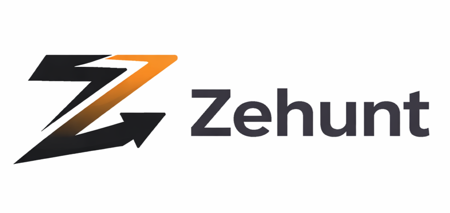

<p align="center">
  
</p>

<h1 align="center">Zehunt Documentation</h1>

<p align="center">
  <strong>Builder Reputation and Growth System</strong><br/>
  Track execution. Build reputation. Unlock opportunities.
</p>

---

## Table of Contents

| Document | Description | Audience |
|---|---|---|
| [Product Requirements (PRD)](./PRD-v2.md) | Vision, value proposition, system design, MVP scope, growth strategy, and KPIs | Product, Engineering, Stakeholders |
| [Backend Architecture](./backend-architecture.md) | Technology stack, database schema, API layer, auth strategy, and migration plan | Engineering |
| [Platform Screens](./platform-screens.md) | Complete route map, screen inventory, role-based access, and UI component reference | Engineering, Design |
| [Design System](./design-system-hand-drawn.md) | Visual language, tokens, typography, components, interaction states, and accessibility | Design, Engineering |
| [Security](./security.md) | Authentication, authorization, data protection, API security, and incident response | Engineering, Security, Compliance |

---

## Quick Reference

### Technology Stack

| Layer | Technology |
|---|---|
| Framework | Next.js 16 (App Router) |
| Styling | Tailwind CSS v4 |
| Database | Supabase (PostgreSQL) |
| Auth | Supabase Auth (OAuth + email) |
| Realtime | Supabase Realtime |
| Storage | Supabase Storage |
| Hosting | Vercel |
| Scheduling | Supabase pg_cron |

### User Roles

| Role | Description |
|---|---|
| Builder | Creates products, posts updates, earns reputation |
| Investor | Discovers builders, tracks execution, expresses funding interest |
| Recruiter | Searches builders, posts opportunities, manages hiring pipeline |
| Admin | Platform moderation, user management, score calibration |

### Key Metrics (Beta)

| Metric | Target |
|---|---|
| Weekly active builders | Growth week-over-week |
| Builder retention (30-day) | > 40% |
| Updates per builder per week | > 2 |
| Opportunity conversion rate | Tracking baseline |

---

## Project Structure

```
zehunt/
├── app/                    # Next.js App Router
│   ├── api/                # API route handlers
│   ├── actions/            # Server actions
│   ├── components/         # Shared UI components
│   ├── lib/                # Utilities and data
│   ├── admin/              # Admin dashboard (separate layout)
│   ├── dashboard/          # Role-based dashboards
│   ├── community/          # Community and ambassador pages
│   └── ...                 # Feature pages
├── docs/                   # This documentation
├── public/                 # Static assets
└── admin/                  # Admin app (separate Next.js project)
```

---

## Version History

| Version | Date | Changes |
|---|---|---|
| v2.0 | April 2026 | Beta release — 38+ screens, role system, collaborative projects, community program |
| v1.0 | January 2026 | Initial PRD and landing page |

---

<p align="center">
  <sub>Maintained by the Zehunt team. Last updated April 2026.</sub>
</p>
